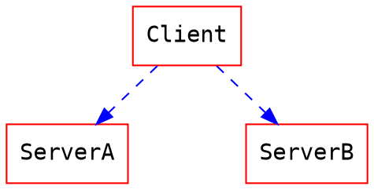
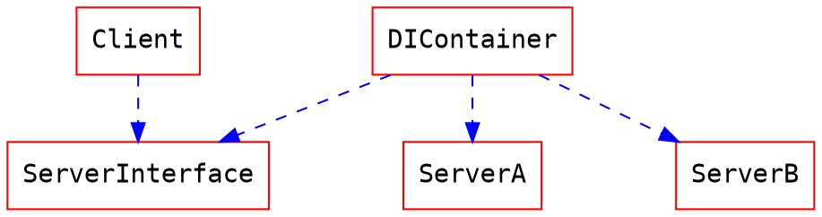

# 簡介

* Dependency Injection (DI) 是一種設計模式，用於降低物件之間的耦合度，從而提高代碼的可重用性、可測試性和可維護性。在Dependency Injection中，物件之間的依賴關係不由物件本身建立，而是由Dependency Injection 容器負責建立。

<br>

---

## What is Dependency ? 

程式上的依賴是指一個物件對象需要另一個Assembly或Class，才能完成自己的功能。具體來說，當一個物件對象使用了另一個Assembly或Class的功能時，就可以說這個組件或對象對另一個Assembly或Class存在依賴關係。

在這範例中可以說`OrderController.cs`依賴了`OrderDataAccess.cs`，`OrderController.cs`必須透過`OrderDataAccess.cs`才能完成取得所有訂單清單功能。
```csharp!
[ApiController]
[Route("api/[controller]")]
public class OrderController : ControllerBase
{
    private OrderDataAccess _orderDataAccess;
    
    public OrderController(OrderDataAccess orderDataAccess)
    {
        this._orderDataAccess = orderDataAccess;
    }
    
    [HttpGet]
    public IActionResult Get()
    {
        var orders = _orderDataAccess.GetAll(); 
        // 略
    }
}

```


依賴關係可以分為直接依賴和間接依賴兩種情況。

* 直接依賴指的是組件或對象直接使用了另一個組件或對象的功能，例如一個Class中使用了另一個 Class的Method。

* 間接依賴則指的是組件或對象的依賴關係被傳遞到了更多層次的組件或對象中，例如一個類使用了另一個類，而這個另一個類又使用了一個第三方類。


<br>


## What is Injection ? 

程式上的注入是指將依賴對象傳遞給需要使用它的對象或方法的一種方式。具體來說，當一個對象或方法需要使用另一個對象或方法的功能時，可以通過Injection的方式將這個依賴對象傳遞進去，讓需要使用它的對象或方法可以正常運作。
注入的方式可以分為三種：

<br>

### 建構子注入（Constructor Injection）
依賴介面由建構子取得，這一類在類別被初始化之後依賴也直接決定了。

```csharp!

public class OrderService
{
    private readonly IOrderRepository _orderRepository;
    
    public OrderService(IOrderRepository orderRepository)
    {
        _orderRepository = orderRepository;
    }
    
}

```

<br>


### 屬性注入（Property Injection）

依賴介面由屬性(Property)取得，在一些Dependency Injection框架在實現Property Injection也會實現延遲載入(Lazy Loading)功能。


```csharp!

public class OrderService
{
    public IOrderRepository OrderRepository { get; set; }
    
    public OrderService()
    {
    }
    
}

```

<br>


### 方法注入（Method Injection）

依賴介面由方法參數取得。在 .Net Core 之中的Middleware有支援。個人目前使用情境甚少使用。

```csharp!

public class OrderService
{
  
    public async Task<OrderDto> GetAsync(string orderId, IOrderRepository orderRepository)
    {
        
        
    }
}

```

<br>

## Dependency Injection? 

Client直接依賴ServerA，在需求異動時候Client與Server均有可能修改。



Client依賴Server的介面，透過DI Container決定了最後的Server是誰


---

<br>
<br>

## 心得

這邊也只是記錄以前前輩教的一些軟體開發上常見的觀念。但是對於後續開發上有很大的幫助。